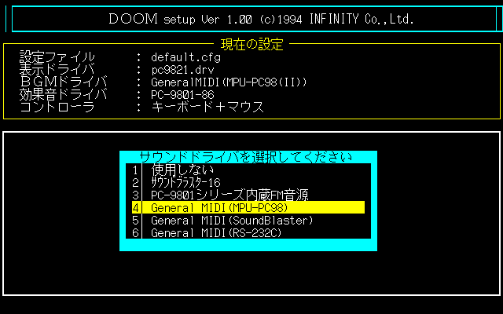
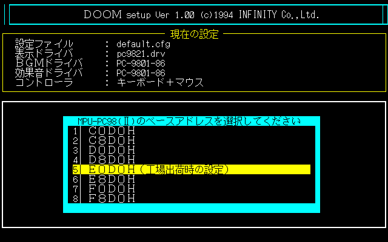

# PC98 (Zet98-486) for MiSTer

A NEC PC-9801/PC-9821-style computer for MiSTer, based on Puu's Zet/98 with a
486 CPU. It runs MS-DOS and standard PC-98 games from hard-disk images,
floppies and CD-ROM.

**Website: [pc98.thefirstboss.com](https://pc98.thefirstboss.com)**: the
[game compatibility list](https://pc98.thefirstboss.com/games/) (add your own
reports) and the [HDI converter](https://pc98.thefirstboss.com/converter/).

> **Old 256-byte-sector `.hdi` images boot directly since B228.** Images such as
> YU-NO, Steam Heart's or Dead of the Brain (10-80 MB SASI disks) no longer need
> converting. With B227 or older, convert them first with the
> [online HDI converter](https://pc98.thefirstboss.com/converter/) or
> [`scripts/pc98_hdi_256to512.py`](scripts/pc98_hdi_256to512.py).

## Features

B246 restores optional disk-activity icons and captions for floppy, HDD and
CD transfers, and moves the EGC shifter into DSP blocks to make room. Its
Apple Club 1 title matches B244 pixel-for-pixel on three fresh loads; the
B245 red-dot regression reproduces on both comparison loads. The exact
90 MHz release bitstream also passes Linux fault-restart/process checks,
EGC, DOS memory/string tests and a full Doom timedemo. Doom performance is
essentially unchanged. The combined build uses **41,427 ALMs / 4,191 LABs**
(47 more ALMs than B245) with worst slack **-7.379 ns**, within the
maintainer's accepted 12 ns magnitude allowance; static timing is not closed.
Use the already released OpenBIOS
[2026-10-06](https://github.com/Elrinth/PC98_Open_BIOS/releases/tag/2026-10-06).
See [validation and limitations](rtl/STORAGE_ACTIVITY.md), including the
unresolved Doom/VCPI and Doom II compatibility failures.

B245 adds **Input > Pad input: Both / Joystick only / Keyboard only** for
USB and SNAC controllers. Keyboard only avoids duplicate joystick and Z/X
actions while retaining Shift and the other mapped keys. For Lotus Land Story,
select Keyboard only with Cursor keys, then bind Z (shot), X (bomb) and Shift
(slow movement). Both remains the default for existing setups.
All 1,040 routing simulation cases and keyboard make/break tests pass. The
90 MHz build fits all 4,191 LABs, with worst slack **-7.354 ns** (within the
maintainer's accepted 12 ns magnitude limit; static timing is not closed).
At publication this B245 bitstream had not been tested on MiSTer hardware;
subsequent Apple Club testing found the red-dot regression described above. No BIOS update
is required for input routing; the latest OpenBIOS is
[2026-10-06](https://github.com/Elrinth/PC98_Open_BIOS/releases/tag/2026-10-06).

B244 returns complete 32-bit reads from the existing extended-RAM buffer.
At the same 90 MHz, hardware measurements show **12% faster extended-RAM
reads and 6.6% faster copies** than B243. Doom completes both timedemos in
1,725 reported realtics versus the same-session B243 control's 1,736
(**0.64% more throughput**, sound disabled). Linux fault-restart checks and
DOS QUALIFY pass with OpenBIOS 2026-10-04.1. See the
[buffered DWORD read results](rtl/cpu/RAM_DWORD_READ.md).

B243 improves general memory throughput and increases the release's instruction
cache to 32 KB. At the same 90 MHz, two Doom timedemos completed in 1,736/1,737
reported realtics versus B242's 1,870/1,870: **7.7% more throughput**, with sound
disabled. Two Linux boots, 200 traced BusyBox `ip` launches and hardware QUALIFY
pass. Continue using OpenBIOS 2026-10-04.1; no BIOS update is needed. See the
[performance and validation notes](rtl/cpu/EARLY_MEMORY_GRANT.md).

B242 fixes a CPU stack-page fault restart bug that could crash Linux BusyBox
when starting `ip`. With OpenBIOS 2026-10-04.1, the corrected core completed
200 `ip` launches without a segfault and passed hardware QUALIFY. No BIOS
update is needed. See the [fault-restart validation notes](rtl/cpu/STACK_PAGE_FAULT.md).

B241 adds native DWORD transfers for the linear PEGC framebuffer. At the
same 90 MHz, a matched Doom timedemo completed 11,520 gametics in 1,872
reported realtics versus B240's 2,008: **7.3% more throughput**, with sound
disabled for both measurements. OpenBIOS boot and hardware QUALIFY passed.
Ordinary RAM retains the B240 path. See the [validation notes](rtl/cpu/NATIVE_DDR.md).

B240 fixes Policenauts PCM gaps and removes two CPU pipeline delays. Earlier
comparisons against B239 measured about 18% more Dhrystone throughput in
simulation and a 9% gain in the Doom timedemo. Use
[Open PC-98 BIOS 2026-10-04.1](https://github.com/Elrinth/PC98_Open_BIOS/releases/tag/2026-10-04.1)
for the matching Policenauts/EMM386 floppy fix. This pair was checked on MiSTer:
Policenauts and Cyberblock Metal Orange music is smooth, and Hokuto no Ken's
N88-BASIC title and story scenes run with keyboard input.

- **CPU:** z486 (486-class) at 90 MHz, **64 MB RAM** (HIMEM/XMS and EMM386/EMS work).
  An OSD **CPU speed** setting slows the CPU for older speed-sensitive games
  (see [game setup notes](#game-setup-notes)).
- **Graphics:** 640x400 16 colours from 4096, GRCG and EGC, 256-colour PEGC,
  hardware scrolling and split screens, Kanji text with the character generator.
- **Sound:** PC-9801-86 board: YM2608 OPNA (FM, SSG, rhythm) and 86 PCM, plus the beeper.
- **MIDI:** MPU-PC98II UART to MiSTer MidiLink (FluidSynth, MUNT or USB MIDI):
  General MIDI music in Doom, Nightslave and others.
- **CD-ROM:** ATAPI drive with **CD audio** (ISO, BIN, or CUE/BIN converted to one
  `.pcd` file). Policenauts plays with its CD music.
- **Hard disk:** IDE with raw VHD/IMG/IMA and HDI images, bootable directly. Both
  512-byte and old 256-byte-sector (SASI) HDIs boot and can be written.
- **Floppies:** two drives, D88 (read/write), HDM and FDI (read-only). Games that
  save to their own disk (Revival Xanadu, for example) need D88: convert with the
  [online converter](https://pc98.thefirstboss.com/converter/). MiSTer Main
  treats `.fdi` files as Spectrum images; rename or convert them to `.hdm`/`.d88`.
- **BIOS:** works with the free [Open PC-98 BIOS](https://github.com/Elrinth/PC98_Open_BIOS)
  (no NEC ROM needed) or a PC-9801VM-based `boot.rom`.
- **Input:** keyboard, USB mouse, joysticks and original PlayStation pads (SNAC),
  right analog stick as mouse.
- **Video:** scaled HDMI (native aspect or integer), and the core's own 640x400
  RGB signal with the real PC-98 timing (24.8 kHz, 56.4 Hz) on VGA/SCART for
  multisync monitors and scalers.

## Quick start

1. Download the `.rbf` from [Releases](https://github.com/Elrinth/Zet98_486_MiSTer/releases)
   and copy it to `/media/fat/_Computer/` (an SDRAM module is required).
2. Copy a `boot.rom` to `/media/fat/games/PC98/`: the
   [Open PC-98 BIOS](https://github.com/Elrinth/PC98_Open_BIOS/releases) is free.
3. Put your PC-98 disk images in `/media/fat/games/PC98/`
   (256-byte and 512-byte-sector HDIs both boot).
   Load the core and open the menu (F12): mount a DOS hard-disk image under
   **IDE hard disk**, or a floppy game under **FDD0**, and reset.
4. Optional: **MPU MIDI: UART** plus MidiLink for General MIDI music
   ([Doom setup](#playing-doom-with-general-midi-music)), a `.pcd` or `.iso` under
   **CD-ROM** ([CD-ROM setup](#cd-rom-atapi-and-cd-audio)).
5. Some games need a particular memory setup (HIMEM only or EMM386): see the
   [compatibility list](https://pc98.thefirstboss.com/games/) and the
   [game setup notes](#game-setup-notes). Known issues are listed with each release.

## Not supported

- Sound Blaster 16 (and other PC-98 sound cards besides the PC-9801-86)
- Faster CPU speeds (no Pentium-class performance beyond the 90 MHz 486)
- More RAM than 64 MB

## Installing on MiSTer

- Copy the core `.rbf` to `/media/fat/_Computer/`.
- Put `boot.rom` and your disk images in `/media/fat/games/PC98/` (builds after
  B165; earlier builds use `/games/Zet98/`). Settings are saved as `PC98.CFG`.
- `boot.rom`: either the free **[Open PC-98 BIOS](https://github.com/Elrinth/PC98_Open_BIOS)**
  (download its release zip; no NEC ROM needed), or a `boot.rom` built from
  your own PC-9801VM BIOS set (see `docs/OPEN_BIOS_NOTES.md`).
- `DEVICE=HIMEM.SYS` works without any extra driver since B165: the core's disk
  extension ROM publishes the extended RAM and clears the V30 flag that the
  PC-9801VM BIOS always sets. `Z98MEM.SYS`/`Z98FIX.SYS` are no longer needed.
- The defaults (Display: Normal, GDC clock: 2.5MHz) suit most games. Only
  **MPU MIDI: UART** needs to be enabled for General MIDI music (below).
- `docs/OPEN_BIOS_NOTES.md` describes the `boot.rom` layout.

## Converting old 256-byte-sector HDI images

Many older PC-98 hard-disk images (10-80 MB SASI disks, often from Anex86 or
early NP2, for example Dead of the Brain, YU-NO or Steam Heart's) use 256-byte
sectors. **Since B228 they boot as they are.** Converting them to 512-byte
sectors is only needed for B227 and older, or for other tools that expect
512-byte sectors:

- **In your browser:** open the [HDI converter](https://pc98.thefirstboss.com/converter/)
  (or `docs/hdi-converter.html` from this repo) and drop the `.hdi` on it. The
  conversion runs locally; nothing is uploaded.
- **Command line** (Python 3 on Windows, macOS or Linux, no extra modules; on
  Windows you can also drag the `.hdi` onto the script):

  ```
  python3 scripts/pc98_hdi_256to512.py "Game.hdi"
  ```

Both write `Game-512b.hdi` next to the original, which is not modified, and warn
if an image already has 512-byte sectors. The DOS partition is copied unchanged;
only the partition table, the boot record's geometry fields and the HDI header
are rewritten (8 heads, 17 sectors per track).

If a converted game stops on an empty screen right after the MS-DOS banner, check
its `CONFIG.SYS` for `DEVICE=...VEM486.EXE`. The VEM486 memory manager works
with the [Open PC-98 BIOS](https://github.com/Elrinth/PC98_Open_BIOS). With the
NEC PC-9801VM `boot.rom` on builds before B224 it hangs (it resets the CPU and
that BIOS cannot resume); put `REM` in front of that line or use the Open BIOS.

Alternatively, copy just the game files onto a DOS VHD that already boots on the
core (back up the VHD first):

```
python scripts/pc98_hdi_to_vhd.py list    "Game.hdi"
python scripts/pc98_hdi_to_vhd.py copy    "Game.hdi" PC98_DOS.vhd GAME
python scripts/pc98_hdi_to_vhd.py extract "Game.hdi" folder     (files to a PC folder)
```

`copy` puts everything into `\GAME` on the VHD's DOS partition. The image's
own DOS system files are skipped; its `CONFIG.SYS`/`AUTOEXEC.BAT` are kept as
`CONFIG.ORG`/`AUTOEXEC.ORG`, which show the drivers the game expects. Start the
game from its directory (for example its original batch file), adding those
drivers to your own CONFIG.SYS if needed.

## CD-ROM (ATAPI) and CD audio

Builds with the raw IDE option have a CD-ROM drive on the IDE secondary channel
(bank 1, master), where NEC's internal-drive driver `NECCDD.SYS` expects it.
Mount a disc image in the core menu under **CD-ROM (ISO/BIN/PCD)**:

- `.iso` (2048-byte sectors) or a raw `.bin` (2352-byte sectors): one data track,
  no CD audio. The drive reads the first blocks to detect raw sync patterns.
- `.pcd`: a whole CUE/BIN disc, data and **CD audio** tracks, in one file. MiSTer
  mounts one file per slot, so the CUE sheet's track list is stored in a header.
  Convert once on a PC (Python 3, no extra modules):
  ```
  python scripts/pc98_cd_image.py "Policenauts.cue"          -> Policenauts.pcd
  python scripts/pc98_cd_image.py game.cue D:\PC98\game.pcd
  ```
  Single-BIN and multi-BIN CUE sheets both work (MODE1/2048, MODE1/2352,
  MODE2/2352, AUDIO; INDEX 00 and PREGAP gaps). The converter never overwrites an
  existing file.
- DOS setup (MS-DOS 6.20):
  ```
  CONFIG.SYS:   DEVICE=A:\TOOLS\NECCDD.SYS /D:CD_101
  AUTOEXEC.BAT: A:\DOS\MSCDEX.EXE /D:CD_101 /L:Q
  ```
  `NECCDD.SYS` (17,616 bytes, "IDE-951031") is NEC's driver for internal ATAPI
  drives; `MSCDEX.EXE` ships with DOS. The disc then appears as drive Q:.
- The drive answers as "NEC CD-ROM DRIVE:98" (the driver checks this), sends one
  2048-byte sector per data request with an interrupt each, and supports the
  commands NECCDD and MSCDEX use (INQUIRY, REQUEST SENSE, TEST UNIT READY, MODE
  SENSE/SELECT, READ TOC formats 0/1 incl. BCD MSF, READ(10), READ CAPACITY, READ
  SUB-CHANNEL, START/STOP, PREVENT/ALLOW, SEEK). The ARTIC 307.2 kHz counter
  (ports 5Ch-5Fh), which the driver uses for timeouts, is implemented too.
- CD audio: PLAY AUDIO(10), PLAY AUDIO MSF (BCD in NEC mode), PAUSE/RESUME and
  STOP PLAY; READ SUB-CHANNEL reports playing/paused/completed and the track and
  position, which games poll to loop their music. Audio sectors stream from the
  image through a 2048-sample buffer at 44.1 kHz and join the core's mix at half
  scale before the audio filter. A data read, SEEK or START/STOP UNIT stops
  playback, as on a real drive.
- Tests: `tests/run-atapi.sh` (ISO, raw BIN, a PCD with one data and two audio
  tracks: TOC, play/pause/stop, sub-channel, sample-exact audio; bank routing next
  to the hard disk) and `tests/test_pc98_cd_image.py` (converter).

## Video outputs: HDMI, VGA and SCART RGB

HDMI always carries the scaled picture. The analog outputs (VGA, and SCART RGB
on boards such as the SuperStation One) carry the core's raster directly:
640x400 inside an 864x440 frame with PC-98 400-line timing: 24.80 kHz horizontal
and 56.37 Hz vertical (a real PC-98: 24.83 kHz / 56.42 Hz; the core's 21.43 MHz
dot clock comes from its main PLL, which cannot make the exact 21.05 MHz). Games also run at that
refresh rate (VSYNC interrupts and GDC retrace status), as on the real machine.
24 kHz is not a TV standard and not standard VGA either: 15 kHz TVs, plain
SCART monitors and 31 kHz-only VGA monitors will not sync. Use a multisync
monitor that accepts 24 kHz (as PC-98 monitors do) or a scaler (for example a
RetroTINK 4K). HDMI stays at 60 Hz through MiSTer's scaler.
HDMI and the analog outputs work at the same time.

Add this to `/media/fat/MiSTer.ini`, in a `[PC98]` section (and in any MGL
`setname` section you use):

```ini
[PC98]
vga_mode=rgb          ; plain RGB (a global vga_mode=subcarrier/ypbpr would override it otherwise)
composite_sync=1      ; combined sync on the HSync pin, needed for SCART RGB
vga_scaler=0          ; analog outputs keep the core's own 24.8 kHz signal
forced_scandoubler=0
```

On a RetroTINK 4K select **SCART -> RGBS (75 ohm)** for the SCART cable, or
**HD-15 -> RGBS** for the VGA cable (combined sync is on the H pin; with
`composite_sync=0` choose **HD-15 -> RGBHV**, but SCART then has no sync).
If a display cannot lock to it, `vga_scaler=1` sends the scaled HDMI
mode (for example 1080p) to VGA instead; SCART is then unusable.

## Playing Doom with General MIDI music

The z486 build with `-MidiUart` contains an MPU-PC98II-compatible MIDI interface
(port E0D0h, IRQ6). It sends MIDI to the MiSTer's UART, where MidiLink can play
it through FluidSynth (or MUNT / a USB MIDI device). Tested with the PC-98 Doom
setup program on build B164; report problems in the issue tracker.

**1. Core menu (F12 in the Zet98 core)**

- **MPU MIDI: UART** (the default is Off, which disables the interface).
- **MIDI volume** (100% default; 75/50/25%, Mute, 125/150/200%) sets the level of the
  FluidSynth/MidiLink music relative to the core's own sound. It scales the Linux
  audio stream where the MiSTer framework mixes it in (a local `sys_top.v` change),
  so it does not alter the game's MIDI data. `FSYNTH_VOLUME` in
  `/media/fat/linux/MidiLink.INI` still sets FluidSynth's own gain.
- **DIP2-8 GDC clock: 2.5MHz** (the default since B165). With 5MHz, some games
  (e.g. Nightslave) program the graphics GDC for 5 MHz timing and the core shows
  the picture repeated and shifted across the screen.
- **DIP1-3 Display: Normal** (the default since B165; Plasma changes some games' palettes).
- These settings are saved per core name (`PC98.CFG`). Launchers (`.mgl`) without a
  `setname` share them; an MGL with its own `setname` keeps separate settings.
- In the MiSTer UART settings for this core, set the UART connection to **MIDI**
  and choose **FluidSynth** in MidiLink (the MiSTer needs a SoundFont installed for
  FluidSynth, as for other cores).

**2. DOS: load HIMEM.** Since B165 plain `DEVICE=HIMEM.SYS` is enough. On older builds, stock PC-98 `HIMEM.SYS` works when the
included `Z98MEM.SYS` driver ([software/z98mem.asm](software/z98mem.asm); the same file is also shared as `Z98FIX.SYS`) loads
first; Doom then starts in about 10-15 seconds:

```
DEVICE=A:\Z98MEM.SYS
DEVICE=A:\DOS\HIMEM.SYS /TESTMEM:OFF
```

**3. Doom's SETUP.** Run `SETUP` in the Doom directory.

- BGM driver (music): **4 General MIDI (MPU-PC98)**. Sound effects driver: keep
  **PC-9801-86** (Doom's effects are digital samples, not MIDI). Do not choose
  5 (Sound Blaster MIDI) or 6 (RS-232C); those ports are not connected.

  

- MPU-PC98(II) base address: **5 E0D0H** (the factory default, 工場出荷時の設定).
  If SETUP asks for an interrupt, choose INT 2 (IRQ6).

  

Save the settings and start `DOOM` (or `DOOM2`).

## Game setup notes

Tested on the MiSTer with builds B207-B221 (2026-09-28/29), with the Ultima VIII
input check repeated on B240 (2026-10-04). "Profile" is the memory
setup in CONFIG.SYS/AUTOEXEC.BAT (the test disk's `PROFILE.BAT` numbers):
**HIMEM** = HIMEM.SYS only, full extended memory; **EMS** = HIMEM.SYS plus
EMM386.EXE.

| Game | Needs | Notes |
|---|---|---|
| Doom II | HIMEM | Its DX386 extender refuses to start under EMM386 ("already in virtual 86 mode"). |
| Ultima VIII Pagan (English, PC-98) | HIMEM without EMM386; latest OpenBIOS or a PC-9821 BIOS | B240 with OpenBIOS 2026-10-04.1 accepts the original executable's word prompt and character-name input, then starts the game. The English translation contains literal underscores between intro words; NP2kai displays them too. Under EMM386: "DPMI error 4002". The PC-9801VM `boot.rom` shows stripes. |
| Flame Zapper Kotsujin | EMS | Returns to DOS under HIMEM only. |
| Sorcer Kingdom | EMS | Loading a save with the mouse works (B207+). |
| Crystal Rinal | - | Asks 1/2/0 at start: 1 is the normal version. |
| E.V.O. Theory of Evolution | LIO graphics BIOS | Works with the PC-9801VM `boot.rom` and with the open BIOS (LIO directory at F990:0000). |
| Steam Heart's | HIMEM | Start with **Z** (Return does nothing on the title). The original release plays. The English translation (Psyklax v0.99) crashes on any machine whose memory layout differs from the translator's; use the [crash-fix IPS](https://github.com/Elrinth/SteamHearts_EN_CrashFix). The intro dialogue's split screen is correct from B221 (four display areas). |
| Black Thorne (16 and 256 colours) | EMS | Dialogue text needs B215+ (CG window at A400:0000). |
| EDGE | - | Disk A in FDD0. For the intro, put disk C in FDD1 and choose START. The intro's split-screen frames are correct from B221. |
| Mime | - | Keyboard works from B207 (8259 priority fix). |
| Touhou 1-5 (Japanese originals) | - | All start; the English-patched 4 and 5 on the test disk show a black screen. |
| Valis and other early (V30-era) games | CPU speed | Games that time themselves by CPU loops (written for an 8-10 MHz V30) can run too fast at Full; try **CPU speed: V30** (or 286). Not yet hardware-tested. |
| Rusty, Nightslave, Bomber Quest, Brandish 2, Briganty, Branmarker 2, Dead of the Brain, Gate of Souls, Groundseed, Harlem Blade, Lemmings, Star Cruiser II, Starfire, The Screamer, Xenon, Yu-No | - | Reach the title or gameplay with either BIOS. |

**CPU speed** (main menu): **Full** is the 90 MHz z486. **386/486** (~8 MIPS),
**286** (~2 MIPS, a 286 at 10-12 MHz) and **V30** (~0.8 MIPS, a V30 at 8-10 MHz)
limit only how fast the CPU executes instructions; the timer, video, sound,
disk and DMA keep their real speed, so music tempo and frame timing do not
change. Games that time themselves with the timer or vertical sync are already
correct at Full; use the slower settings for games that count CPU loops. The
setting takes effect immediately and can be changed while a game runs.

BIOS: the known-working `boot.rom` is built from MAME's PC-9801VM set (see
`docs/OPEN_BIOS_NOTES.md`). The PC-9801UX, PC-9821, PC-9821Ce2, PC-9821V13 and
PC-9821V20 sets (NP2-style `bios.rom`/`itf.rom`/`font.rom`) do not start on the
core yet. The [Open PC-98 BIOS](https://github.com/Elrinth/PC98_Open_BIOS) boots MS-DOS and the games above.

## Development history

A PC-98 core development project based on **Puu's Zet/98**. The primary
acceptance target is smoother **Rusty** gameplay on MiSTer-compatible hardware,
initially a SuperStation One with SuperDock. A faster CPU must preserve game,
video, timer, sound and disk timing.

**Experimental: the default build still uses Zet.** The optional ao486 build
runs on the SuperStation One and has passed hardware CPU, 64 MB physical-memory,
XMS, disk and interrupt diagnostics at 50 MHz. Rusty reaches its title, intro
and first-stage graphics; Nightslave reaches its title menu. Gameplay frame
rate has not yet been measured; JT08 listening results are recorded below. This is not a
complete PC-9821 implementation or a DX4/Pentium performance claim.

The current tested z486 candidate is **#139: 90 MHz / 64 MB / JT08**, with
bank-aware upper-conventional instruction caching and native VHD/IMG boot.
The user reports correct Rusty gameplay speed on #138 and correct C-LAB speech
pitch after #139's PIT clock correction. #139 passes CPU, RAM, FM IRQ and OPNA
diagnostics plus full saved-result disk audits. Worst setup slack is -6.434 ns,
within the user's experimental allowance; hold/recovery/removal pass. This is
not timing closure or a measured historical-CPU performance equivalence.

Build #142 adds native HDM/FDI/NFD/HDI loading, CPU speed selection and MPU
MIDI. Full90 diagnostics pass and the user confirms NightSlave MIDI music.
**Use Full speed:**60/30 selections stall during DOS startup (root cause found
in simulation after B231 and fixed; the OSD option returned with Full/386-486/
286/V30 settings, not yet hardware-tested; see [CPU speed control](rtl/Z486_PC98.md)). Popful Mail has
striped graphics; Metal Force and Burning Dragon remain unresolved. A revised
disk ROM boots the previously failing Xanadu HDI into user-confirmed gameplay
and Lemmings into its intro through a temporary loader on #142. The integrated
#143R2 revision remains to be hardware-tested. MiSTer Main intercepts PC-98 `.fdi` files as Spectrum images; a
byte-identical `.hdm` copy bypasses that host bug. It is not fully qualified
yet. See [format limits](rtl/storage/README.md) and [CPU speed control](rtl/Z486_PC98.md).
Native HDM/FDI mounts are read-only; D88 supports saving as before. Native NFD
loading was removed after B167 to free FPGA area; convert NFD images to D88 with
`scripts/import_disk_image.py`.

The development features and earlier qualification history include:

- **ao486 and memory:** optional 16/64 MB DDR-backed RAM and a conventional-RAM
  cache. The 50 MHz hardware benchmark is about 2.31x faster for arithmetic and
  2.13x for RAM copy than the matching 20 MHz build. Actual XMS allocation,
  copy and free pass with both the limited and full-memory DOS profiles.
  Completed-word cache allocation raises the hardware stack benchmark from
  80 to 102 blocks per ten seconds at the same 50 MHz (27.5%); this is not a
  measured Rusty frame-rate gain.
- **PC-9801-86 sound:** OPNA/FM plus experimental PCM/FIFO/IRQ support. A lost
  FM timer-clear write was fixed; Native50 and Bundle50 pass 100 consecutive
  timer-B IRQ12 deliveries and cascaded PIC EOI. These silent diagnostics do
  not certify musical timing or sound quality.
- **Alternative OPNA engine:** `-OpnaBackend JT08` selects the
  [PC88 JT08 adaptation of Jotego JT12](rtl/OPNA_JT08.md), retaining the separate
  86-board PCM engine. All six FM voices, three PSG voices, six rhythm sounds,
  stereo panning, LFO, SSG envelopes and bus/timer behavior pass simulation at
  75/100 MHz. Build #115 passes actual hardware CPU, 64 MB map, FM interrupts
  and Rusty's original OPNA-detection procedure. Its worst reported slack is
  -5.783 ns at 100 MHz. The user reports much better Rusty intro music and
  authentic-sounding drums. The later #139 PIT correction is now user-confirmed to fix C-LAB speech pitch.
- **Hard disk:** a raw `.vhd`/`.img` controller and DOS disk service support
  file persistence, independently checked against the resulting FAT and data
  sectors. New `-RawIde` builds include a [native disk option ROM](software/DISK_BIOS.md)
  with common PC-98 DOS geometry discovery and an empty-media prompt. Build
  #137R3 boots DOS 6.20 directly from both raw VHD and IMG on hardware, with
  70,001-byte file persistence and complete image audits passing. Earlier
  builds through #136 require the helper floppy.
- **Display:** native-aspect fit, exact integer fit and HDMI-only integer crop,
  plus the supplied animated floppy indicator with D0/D1 captions. Hardware
  reports 1728x1080 fit, 1280x800 integer fit and a centered 1920x1080 crop.
  Standard 15 kHz SCART conversion is not implemented.

The PlaneAligned60 build has no negative slack in the reported timing checks
(minimum +0.061 ns) and runs on the SuperStation One. Fresh hardware tests pass
the CPU checksums, 64 MB physical-memory map, graphics-plane alias checks and
100 FM timer-B IRQ12 deliveries. Its benchmark reports 286 ALU, 152 RAM-copy
and 114 stack blocks per ten DOS seconds. Rusty's title and intro display;
gameplay frame rate and audible music quality remain unmeasured. External
board-I/O constraints, including SDRAM, remain incomplete.

Experimental 75 MHz build #111 has now passed the hardware CPU checksums,
64 MB physical-memory map, both graphics-plane diagnostics, and 100 FM
timer-B interrupts. Its benchmark scores 345 ALU, 176 RAM-copy and 127 stack
blocks per ten DOS seconds, compared with 286/152/114 at 60 MHz. Rusty's
opening and title menu display. This build still has -2.352 ns worst reported
CPU setup slack; these board tests do not establish timing closure or complete
game/audio stability. See [hardware evidence and limitations](HARDWARE_TESTING.md).

Experimental build #113 runs at **100 MHz with 64 MB RAM**, using ao486,
PC-9801-86 audio, an 8 KB conventional-memory cache, upper-RAM instruction
cache, raw IDE and MIDI UART. It passes the hardware CPU, physical-memory,
graphics alias, GRCG comparison and FM interrupt diagnostics. DOS 6.20 also
passes direct XMS allocation/copy/free with 63,424 KB free and a 17 MB block
above 16 MB (NEC MEM's display still misreports XMS with HIMEMX). The benchmark
scores 429 ALU / 193 RAM-copy / 163 stack blocks per ten DOS seconds: 24.3% /
9.7% / 28.3% above the tested 75 MHz build. Rusty reaches its title menu and
responds to Enter. Worst reported slack is -6.063 ns; sustained gameplay FPS
and audible music quality remain unmeasured.
Build it with:

```powershell
./scripts/build.ps1 -SystemClockMHz 100 -Cpu ao486 -ExtendedRamMB 64 -SoundBoard PC9801_86 -LowMemoryCache -LowMemoryCacheKB 8 -UpperRamICache -RawIde -MidiUart -BuildCpus 8 -BuildMemoryGB 8 -StartOnly
```

The system clock changes while SDRAM remains at 100 MHz and video at 75 MHz.
The user-approved experimental limit is -12 ns worst reported slack; this
does not change the timing constraints or establish timing closure. Board
diagnostics must pass before evaluating game performance. The current historical
performance target is NEC's
[PC-9821Xa10](https://support.nec-lavie.jp/support/product/data/spec/cpu/95110022-1.html)
with its 100 MHz Pentium, configured with 64 MB RAM. This supersedes the earlier
DX4/Ap3 preference. The current CPU is z486, with ao486 retained as an alternative; matching clock frequency and
RAM capacity does not establish Pentium performance or full-machine compatibility.

An optional [MPU-PC98II UART prototype](rtl/midi/README.md), built with
`-MidiUart`, passes serial, bus and interrupt simulations, 200 guest IRQ6
acknowledgements and exact capture of a 134-byte packet on HPS ttyS1 in hardware.
The first capture exposed a missing HPS UART1 location assignment; correcting
and verifying that placement fixed the transport. Local MidiLink/FluidSynth
starts with GeneralUser GS. The corrected MIDI build passes polled-ACK
withdrawal, 200 IRQ acknowledgements and the 134-byte UART capture on hardware.
Nightslave progresses into its intro with MIDI selected; its instrument
programs, ongoing UART traffic and changing FluidSynth voice counts confirm
active software synthesis. TV audio quality and complete soundtrack timing
remain unverified. It is off by default and does not implement intelligent-mode
sequencing. A private Nightslave UART trace passes RTL replay; that alone does
not establish hardware music compatibility.

DOS, BIOS ROMs, games and prepared private disk packages are not distributed
in this repository. Complete intelligent-mode MPU-401 and optical-drive support remain pending.
Native HDI/HDM/FDI/NFD loading is implemented in the next candidate and awaits
hardware qualification; the import utility remains available for writable D88 copies. Original PC-98 Doom and Doom II
reach their menus and play on the 90 MHz z486 test build B164 (see below); sound and long play are still being checked.

## Priorities

1. Optimize Rusty gameplay with PC-9801-86 sound, preserving video, audio and
   disk timing. Increase CPU clock only with FPGA timing and hardware evidence.
2. Develop the ao486 integration toward a faster PC-9821-class machine, including
   extended RAM (16/64 MB), interrupts, DMA and BIOS support.
   Normal builds retain the lowest-1-MB map. An optional DDR-backed 16/64 MB
   map passes CPU simulation and physical-memory diagnostics on the SuperStation
   at both sizes. The experimental [DOS memory setup](software/README.md) also
   passes hardware XMS allocation/copy/free tests at 16 and 64 MB. It requires
   an initializer and the PC-98 HIMEMX driver on the user's boot disk; it is
   not enabled by the original BIOS alone. This does not establish complete
   PC-9821 compatibility.
3. Support raw PC-98 hard-disk images, including MiSTer-style `.vhd` files, with
   a working disk controller and BIOS path. Dynamic VHD/VHDX containers are a
   separate format and are not promised by a `.vhd` file selector.
   Provide a bootable, user-supplied DOS setup with documented CONFIG.SYS and
   AUTOEXEC.BAT settings for a multi-game disk.
   The experimental [`-RawIde` controller](rtl/storage/README.md) now passes
   task-file and real HPS-interface simulations. Its
   [read BIOS prototype](software/DISK_BIOS.md) passes hardware geometry,
   partition, cylinder-crossing and 64 KB read checks against the private VHD.
   A BIOS-first diagnostic floppy now boots that VHD into DOS 6.20 on Native50
   and launches Rusty's illustrated intro. An optional bounded write BIOS
   passes sector-level hardware checks. Bundle50 also creates, flushes and
   reopens a 70,001-byte file on a separate game VHD; independent comparison
   verifies the data and limits all changes to that file's allocation and
   directory entry. ROM integration and general image/geometry discovery
   remain unfinished.
   A disposable hardware diagnostic passes IDENTIFY,
   sector write/read checksum and four IRQ9 deliveries; only the designated
   test sector changed in the returned image.
   A private DOS 6.20 image now boots Rusty, Nightslave and Doom II in a
   software PC-98 emulator. Its [configuration templates](disk-templates/dos620/README.md)
   provide memory profiles and a game launcher. Four FPGA-oriented profiles
   also boot on Bundle50; EMM386-based profiles remain software-emulator-only. An [import utility](scripts/import_disk_image.py) converts
   standard HDM/FDI/NFD-R0 floppies to D88 and 512-byte-sector HDI disks to raw
   images. Native selection of those additional container formats is pending.
4. Add the PC-98 MIDI interface used by games and route it through MiSTer MidiLink
   for local MUNT/FluidSynth synthesis and USB MIDI hardware. External MT32-pi
   support is a further option, not a requirement for listening to MIDI.
5. Keep full-screen scaling and provide an optional rotating floppy activity
   icon, enabled by default. Assess the SuperStation One optical drive as a
   later storage extension once its host interface is established.
   New [video options](VIDEO_OUTPUT.md) add HDMI integer scaling, capture the
   actual 400-line picture and show the supplied 59-frame disk animation with
   a D0/D1 label and cycling dots. The animation matches the imported frames in hardware captures. New
   native-aspect fit (default), exact integer fit and HDMI-only integer crop
   choices pass simulation and fit in Native50. Hardware confirms native fit
   at 1728x1080 and integer fit at 1280x800 on the 1080p test profile.
   Integer zoom reports a 640x360 crop into 1920x1080. Standard 15 kHz SCART scan conversion is not yet
   implemented.

## Current source and build

The imported baseline is `dentnz/Zet98_MiSTer` commit
`1efa2d5` (full upstream history retained). The MiSTer project is
`Zet98/v17/Zet98.qpf`, revision `release-Zet98MiSTer`, using Quartus Lite 17.0.
The internal core name remains `Zet98` during baseline work, preserving the
existing game-directory and settings identity. The GitHub repository name is
independent of that identifier.

With Docker Desktop running, from PowerShell:

```powershell
./scripts/build.ps1
```

The B242 release profile uses `-Cpu z486 -SystemClockMHz 90 -ExtendedRamMB 64
-SoundBoard PC9801_86 -OpnaBackend JT08 -RegisterPacking Normal -RawIde
-MidiUart -PackedGraphics -UpperRamICache -Z486PipelineRegs 2 -Seed 12
-NativeDdr -NativeDdrFramebufferOnly`.
Both native-DDR flags are required for the released graphics-only optimization;
the full-native RAM mode remains experimental and fails hardware startup.
Pipeline value 2 keeps the effective-address register, removes the registered
decoder entry delay and enables early data requests. The larger October 2026
upstream z486 rewrite is not included.

The script uses the locally installed `theypsilon/quartus-lite-c5:17.0` image
by default. Override `-Image` and `-DockerContext` if needed. It compiles an
isolated source snapshot under `build/`, retaining the log and Quartus reports.
Builds default to three CPU cores and one concurrent Quartus container.
`-BuildCpus` controls both the container CPU quota and Quartus worker count;
`-MaxConcurrentBuilds` allows an explicit concurrency override (up to three).
A launch is rejected while the chosen number of build containers is running.
Quartus runs on Docker's native Linux filesystem, with source copied in and the
complete project database/reports copied back. This avoids observed stalls on
Docker Desktop's Windows bind share. Failed exports retain the named container
for inspection. A post-fit guard also verifies global routing of the pixel clock.
Another guard checks the fixed HPS SPI and HDMI I2C locations, plus UART1 in
MIDI-enabled builds, against the actual fitted primitives.
Compilation alone does not establish working hardware or acceptable timing.
After compilation, the script records the reported slack in `timing-results.json`
and exits with an error if any timing check reports negative slack. The RBF and
reports are retained for investigation. Missing timing results also fail the
build; nonnegative slack still requires constraint-coverage review.

The imported 20 MHz baseline completed Quartus compilation on 2026-09-20, using
49% of the FPGA ALMs, but **failed timing** (worst reported setup slack
`-22.563 ns`, plus unconstrained paths). Its generated RBF is not a verified
release. The timing failures must be understood before claiming stable higher
clock rates. `scripts/report-timing.tcl` generates detailed paths from a fitted
project for this investigation. `./scripts/report-timing.ps1 -BuildDirectory
build/<snapshot>` runs that audit on native Linux storage and exports the
critical-path and CPU/system-clock reports back to the snapshot.

An experimental **40 MHz Zet** build can be prepared with
`./scripts/build.ps1 -SystemClockMHz 40`. It is an intermediate performance
experiment, not the 486 upgrade. The default remains 20 MHz. The 40 MHz build
adjusts the system-frequency parameter, PS/2 clock divider, OPNA clock enable,
and VFO interrupt pulse width; SDRAM and video clocks stay at 100 and 75 MHz.
It needs timing closure and hardware checks for boot, floppy access, music
pitch/tempo and Rusty gameplay before it can be recommended. A doubled clock
does not imply doubled frame rate. `-PrepareOnly` creates the source snapshot
without running Quartus.

The first 40 MHz experiment compiled on 2026-09-20 but **failed timing**. Its
CPU-only setup path has `-11.991 ns` slack at the slow 100 C corner, with a
system-clock Fmax estimate of `27.03 MHz` for same-clock paths. Increasing the
clock alone is therefore not a reliable 40 MHz solution. The 486 integration
remains the performance path; these measurements are not Rusty benchmarks.

Use `./scripts/build.ps1 -Cpu ao486` for the optional full CPU integration at
20 MHz. Its memory and I/O bridges now connect to the PC-98 fabric, with
independent even/odd I/O decoding and a separate interrupt-vector path. CPU-only
simulation passes 486 `BSWAP`, unaligned DWORD memory and I/O, `REP MOVSD`, A20
switching, reset-ROM aliases, interrupt/IRET, and software CPU reset. The existing
PC-98 PICs separately pass master/slave vector, masking and EOI tests.

The first complete ao486 build finished on 2026-09-21 (local time). It fits
with 32,397 / 41,910 ALMs (77%), 395 / 553 RAM blocks (71%), and 63 / 112 DSP
blocks (56%). CPU-register setup paths pass at 20 MHz with `20.482 ns` slack,
but the **complete design still fails timing**: 13 negative-slack checks,
worst `-22.188 ns`, including crossings between the system, SDRAM and video
clocks. Passing the CPU paths does not make this a timing-clean core or
establish a higher usable clock. The test RBF is for boot investigation only.

The source now removes a combinational feedback loop between the two PC-98
data-bus byte lanes. Device selection is resolved before DMA byte routing,
preserving the old priorities without routing final outputs back into each
other. Simulation matches the historical mux over 57,748 cases. The new fit
improves worst reported slack from -22.883 ns to -5.493 ns, but still fails
timing; the additional pixel-clock audit also finds violations. This is not
yet a clock-rate result. The bus rewrite is included in the newer Cache test
RBF; its full-design timing still fails at -5.704 ns, while CPU setup passes.

The default integration retains the existing low-1-MB memory map.
Unmapped addresses return `FFFF` and discard writes instead of aliasing low RAM.
CPU control ports F0/F2/F6 implement reset and A20 controls, using
[NP2kai's CPU I/O implementation](https://github.com/AZO234/NP2kai/blob/5939e0c6d5985c4c08fc70f289a83290e5d3e6f7/io/cpuio.c)
as a behavioral reference. Extended RAM, NMI, independent CPU clocking and
complete game compatibility remain work in progress. Cache is forced off in
the earlier DiskFix RBF. The newer Cache test RBF enables instruction caching for
fixed low RAM, with full invalidation for external DMA and aliased bank-window
writes. It also allows DMA to acquire an already idle CPU bus, which becomes
essential when the CPU executes cached code. Simulation passes, including
stale-code negative controls. The full FPGA build fits but still fails timing.
On the SuperStation One at 20 MHz, the new build passes both hardware benchmark
checksums and gives about 29x arithmetic-loop and 22x RAM-copy throughput versus
uncached ao486 at 20 MHz. These are small hot-loop results, not Rusty frame rates
or a comparison against the original Zet CPU. See the hardware notes for raw
counts, timing limits and the separate 66 MHz CPU feasibility result.
An uninterrupted hardware run now has user-confirmed improvement in Rusty's
animation ("a bit better"); acceptable gameplay speed is still unverified.
Further source changes separate CPU and DMA write data from unrelated
peripheral reads, reducing the I/O-only fit's worst reported timing failure to
-3.864 ns. The follow-up memory/FDC change passes simulation and is being built.

Run `./scripts/test.ps1` for simulation; see [tests/README.md](tests/README.md).
Hardware observations and the isolated test setup are recorded in
[HARDWARE_TESTING.md](HARDWARE_TESTING.md).

`Startup mute: 10s / Off` defaults to **10s** (status bit 4 clear). It silences
the PC-98 speaker for at least ten seconds after core start/reset, then restores
it when the speaker becomes inactive. An ongoing boot beep stays muted to its
end; later software tones are allowed. FM/PSG audio paths and mixer gain are
preserved. Select **Off**
to hear startup beeps immediately. This is a fixed timer, not BIOS-completion
detection; early software speaker tones within those ten seconds are also
muted. Earlier test RBFs use a fixed ten-second timer that can expose a long
beep's tail. The revised behavior passes simulation; hardware checks are pending.

`Audio filter: On / Off` defaults to **On** (status bit 34 clear). The FM (OPNA, 55.5 kHz) and PCM86 (44.1 kHz) outputs are held sample staircases; the MiSTer framework takes 48 kHz samples of them, which folds high tones back as audible noise (a 10 kHz FM tone also appears at 2.5 kHz, only 13 dB down). `rtl/audio_decimator.sv` band-limits the mix to 48 kHz on the framework's audio clock: a CIC to 768 kHz, then a 255-tap FIR (flat to 18 kHz, -75 dB from 28 kHz, coefficients from `scripts/design_audio_decimator.py`). In simulation the worst alias drops from -13 to -67 dBc (FM) and from -7 to -65 dBc (PCM86). **Off** restores the previous direct output for comparison.

`SNAC PS pads: On / Off` (default On, status bit 38 clear) reads original PlayStation
controllers on the MiSTer user port with the standard SNAC wiring (for example the
SuperStation One's PlayStation ports): port 1 is joystick 1, port 2 joystick 2,
combined with USB controllers. D-pad, or the left stick of a DualShock in analog mode,
gives the directions; Cross/Square are trigger 1 and Circle/Triangle trigger 2 of the
PC-98 sound-board joystick port. `rtl/snac_psx_pad.sv` polls both ports about 60
times per second at 250 kHz and only accepts replies with the PlayStation 5Ah
handshake, so other user-port hardware cannot create input; with the option Off
the user port is not driven.

`Input > Pad input` selects **Both / Joystick only / Keyboard only** for USB
and SNAC controllers. **Both** preserves the previous behavior and existing
saved settings. **Joystick only** sends no emulated keyboard keys; use it for
games with native joystick support, such as Touhou Gensoukyou / Lotus Land
Story, where simultaneous joystick and Z/X input can trigger shot and bomb
together. **Keyboard only** disconnects both emulated joystick ports and sends
only the selected keyboard mapping. Physical keyboards and stick-mouse input
are unaffected.

For Lotus Land Story, prefer **Keyboard only** plus **Pad to keyboard: Cursor
keys** to retain pad-controlled slow movement as well: use MiSTer's **Define
joystick buttons** to bind **Fire 1 / Z** (shot), **Fire 2 / X** (bomb), and
**Shift** (hold for slow movement). The **Esc** binding pauses the game.
Joystick only avoids the duplicate shot/bomb actions, but its two-button native
port does not carry Shift; a physical keyboard can still supply it.

`Pad to keyboard` still selects **Numpad / Cursor keys / Buttons only / Off**.
The first three map the fire buttons to Z/X. **Off** disables keyboard mapping
even in Keyboard only mode (so no joystick or keyboard pad input is sent).
Changing routes releases the old emulated inputs through the existing keyboard
make/break handling. The new route uses status bits 48:47; zero preserves Both,
the reserved value 3 suppresses both routes, and the existing keyboard mapping
stays at bits 46:45.

`Stick mouse: On / Off` (default On, status bit 39 clear) moves the PC-98
mouse with an analog stick of a USB controller or of a DualShock in the
SNAC port (analog mode). `Mouse stick: Right / Left` (default Right, status bit 40)
picks the stick: with Left, the left stick moves the mouse and the right stick gives
the joystick directions instead (the d-pad keeps working either way).
Mouse buttons: on SNAC pads L3/L1 = left and R3/R1 = right;
on USB controllers map the core's **Mouse L** / **Mouse R** buttons in MiSTer's
*Define joystick buttons* (for example to L3/R3). A dead zone and a quadratic
curve keep small movements precise. A USB mouse (and the PS5 touchpad, which
MiSTer reports as a mouse) keeps working; all sources add up
(`rtl/stick_mouse.sv`, extra input of `Zet98/MOUSE/MOUSECONV.vhd`).

The compact disk/CD/HDD activity overlay uses one shared icon/caption and one
M10K ROM. **Audio & Video → Disk activity** switches it on or off. It shows
floppy loading/writing and CD/HDD reads or HDD writes. See
[implementation and qualification notes](rtl/STORAGE_ACTIVITY.md).

The source now offers `Aspect ratio: Full Screen` through MiSTer's scaler.
The existing 4:3 and 16:9 setting values are preserved. This affects scaling,
not video synchronization; it does not claim to fix the observed frame glitches.
It is present in the newer DiskFix test RBF, but not the first ao486 image.

The newer experimental test build registers pixel data, blanking and sync together
with the MiSTer pixel enable. It also replaces the variable modulo in the text
font-address path with a scanline counter, verified for all 32 character heights.
`Video test: Color bars` supplies an independent 640x480 raster through the
same scaler/HDMI path (status bit 3). This helps distinguish PC-98 graphics
generation from output-path faults. These changes pass simulation; the hardware
glitch is not claimed fixed until retested.

For the existing experimental RBFs, select **DIP1-3 Display: Normal** and
restart the game. The legacy zero-valued setting is **Plasma**. Popful Mail
reads this switch and selects a different palette routine in plasma mode,
producing incorrect colours on the normal colour display. B148's unmodified
intro was verified with the Normal setting; it also requires B148's
semigraphics fix to remove the vertical white stripes.

## Credits and provenance

- **DoubleJ472** — thanks for pointing us to z486 and CPUBENCH.EXE, and for
  sharing practical PC-98 core development and audio experience.
- **nand2mario and z486 contributors** — [z486 CPU](https://github.com/nand2mario/z486)
  and [z486 MiSTer integration](https://github.com/nand2mario/z486_MiSTer).
  The exact imported revisions and local changes are recorded in
  [z486 provenance](rtl/vendor/z486/UPSTREAM.json).
- **José Tejada Gómez / Jotego and JT12/JT49 contributors** — Yamaha sound
  implementations underlying our JT08 OPNA backend; **PC88_MiSTer contributors**
  — the imported YM2608 integration. This is the PC88 JT08 adaptation, not a
  claim that jt08.v is part of the current upstream JT12 tree. See
  [audio provenance](rtl/vendor/jt08/UPSTREAM.json) and
  [OPNA integration notes](rtl/OPNA_JT08.md).
- **ZOBplus Hayami** — CPUBENCH, the owner's separately supplied benchmark.

- **Puu / プー** — original Zet/98 PC-98 implementation and peripheral work.
  [Original development blog](https://fpga8801.seesaa.net/category/22270192-1.html).
- **dentnz** — [GitHub source import and MiSTer wrapper update](https://github.com/dentnz/Zet98_MiSTer).
- **Zeus Gómez Marmolejo and the Zet contributors** — original Zet CPU.
- **Alexey Melnikov / Sorgelig and MiSTer contributors** — MiSTer infrastructure.
- **Aleksander Osman and ao486/MiSTer contributors** —
  [ao486](https://github.com/MiSTer-devel/ao486_MiSTer), the replacement CPU.
- [X68000 for MiSTer](https://github.com/MiSTer-devel/X68000_MiSTer) and
  [MidiLink](https://github.com/MiSTer-devel/MidiLink_MiSTer) are storage/MIDI
  integration references; referenced features are not automatically implemented here.

This is an independently maintained derivative project, not an official release
by Puu or MiSTer-devel. Existing copyright and license notices remain in their
source files; this README does not replace or relicense those components.
Machine BIOS files and game images must be supplied separately.
